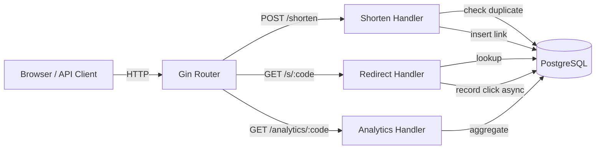

# Nango

[](https://go.dev/)
[](https://www.docker.com/)
[](LICENSE)

URL shortener with click analytics. PostgreSQL persistence, type-safe SQL codegen, REST API, structured logging, graceful shutdown. Built with Go.

## Tech Stack

**Go** · **Gin** · **PostgreSQL** · **sqlc** · **pgx** · **Docker** · **golang-migrate**

## Architecture



## Quick start

```
cp .env.example .env
docker compose up -d --build
```

Open `http://localhost:8080/health/live` - should return `{"status":"UP"}`.

## API

### Public endpoints

```
POST /shorten                create a short link
GET  /s/:shortCode           redirect to original URL
GET  /analytics/:shortCode   click analytics
GET  /health/live            server liveness
```

## Configuration

All settings in `.env`. Copy `.env.example` and fill in your values.

| Variable | Default | Purpose |
|----------|---------|---------|
| `HTTP_PORT` | `8080` | listen port |
| `LOG_FORMAT` | `text` | logging format: text or json |
| `BASE_URL` | - | base URL for short link generation (required) |
| `DB_HOST` | - | PostgreSQL host (required) |
| `DB_PORT` | `5432` | PostgreSQL port |
| `DB_USER` | - | PostgreSQL user (required) |
| `DB_PASSWORD` | - | PostgreSQL password (required) |
| `DB_NAME` | - | database name (required) |
| `DB_SSL_MODE` | `disable` | PostgreSQL SSL mode |
| `MIGRATION_DIR` | `migrations` | path to migration files |
| `DB_MAX_OPEN_CONNECTIONS` | `25` | max PostgreSQL connections |
| `DB_MAX_IDLE_CONNECTIONS` | `10` | max idle connections in pool |

## Docker Compose

| Service | Role |
|---------|------|
| `postgres` | PostgreSQL 18 with `pg_isready` healthcheck |
| `app` | Go binary, waits for healthy postgres, auto-migrates |

All services on the `urls-network` bridge. App healthcheck via `curl /health/live`. Volume `pg_data` persists across restarts.

## Structure

```
cmd/
  server/
    main.go               entry point, calls app.Run()
internal/
  app/                    dependency injection, router setup, graceful shutdown
  config/                 .env loader with validation and defaults
  handler/                HTTP handlers
  repository/             pgxpool, CRUD via sqlc-generated code, migrations
  service/                business logic
migrations/               golang-migrate SQL files
```

Database migrations run at startup via `golang-migrate`. Clicks are recorded asynchronously on redirect via a goroutine. SQL queries are generated from annotated `.sql` files by `sqlc`, providing type-safe database access with pgx/v5.

## Testing

```bash
go test ./internal/... -count=1 -short
```

- **Service layer**: table-driven unit tests with mocked repository
- **Handlers**: integration tests with `httptest` and Gin test mode
- **Config**: validation, defaults, DSN generation

## Development

```
docker compose up -d           # start PostgreSQL
go run ./cmd/server            # start the server
docker compose down            # stop containers
go test ./internal/...         # run all tests
```